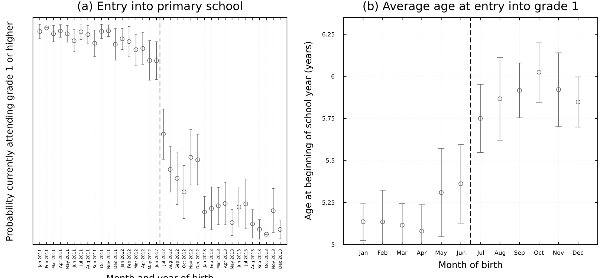
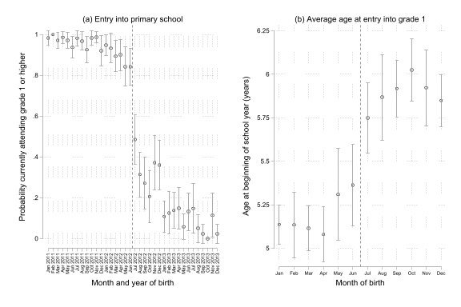
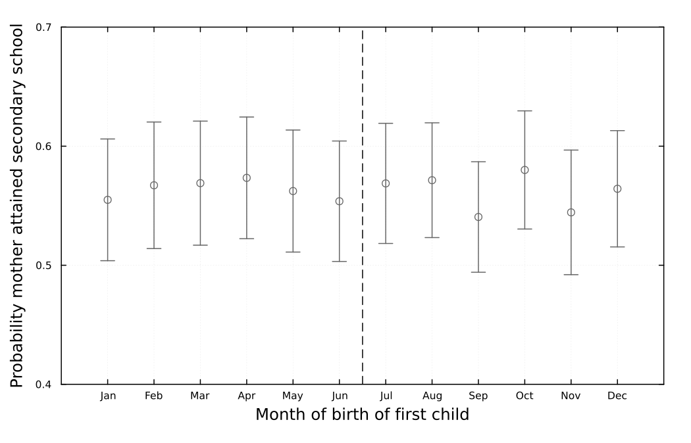
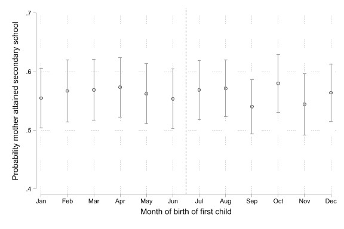
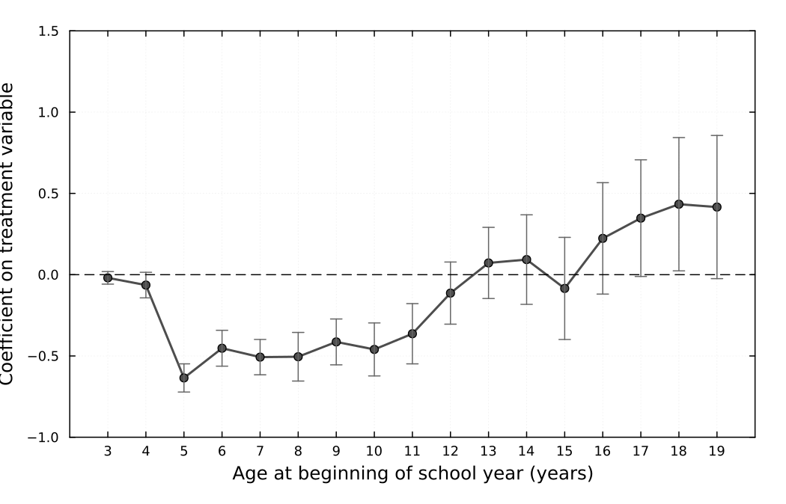
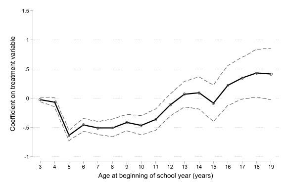
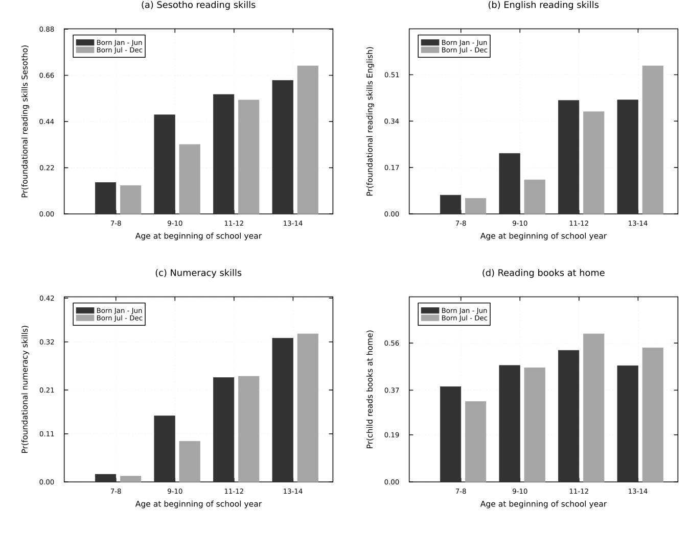
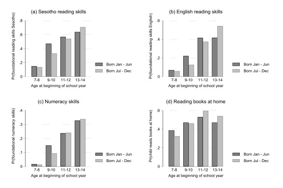

::: {.callout-note}

# Collegio Carlo Alberto Replication Project

This report was created as part of the assessment for the [`Computational Economics` Course](https://floswald.github.io/CompEcon/) in the PhD program at Collegio Carlo Alberto taught by [Florian Oswald](https://floswald.github.io/).

:::
## Paper and Replication Package

This report attempts a replication of 

* paper: 10.1257/app.20230709
* replication package: 10.3886/E217581V1

by using the `julia` computation language.

We have been able to replicate the following exhibits:

1. Figure 1 : Month of birth and entry into primary school
2. Figure 3 : Continuity in pre-treatment characteristics: maternal education
3. Figure 5 : Reversal of early disadvantage for cohorts born July–December
4. Figure 18 : Foundational reading, numeracy skills, and home reading habits by age and month of birth
5. Table 2 : Effect of age at school entry on children's time use by gender

> **Partial results and caveats:** The original paper uses Stata for all estimation and figure production. We replicated the analysis in Julia using the `FixedEffectModels.jl`, `GLM.jl` and `Plots.jl` files. The four figures are successfully replicated, some minor visual differences arise from differences between Julia's `Plots.jl` and Stata's `rdplot` command.

## High Level Description of Computational Problem in Paper
The paper evaluates the impact of age at school entry on human capital development in Lesotho using a **regression discontinuity design (RDD)**. The key identifying variation is Lesotho's enrollment age threshold: children born on or before June 30 must enroll in grade 1 in January of the same year (at age ~5.3 years), while children born July 1 or later may defer enrollment by one year (entering at age ~5.8 years). This creates a local natural experiment in the age at which children begin primary school.
The base specification is a standard linear RDD estimated separately for the six-month windows on either side of the cutoff:

$$
E[Y_i \mid \text{MOB}_i] = \beta_0 + \beta_1(\text{MOB}_i) + \beta_2 \times \mathbf{1}[\text{MOB}_i \geq \text{July}] + \beta_3(\text{MOB}_i) \times \mathbf{1}[\text{MOB}_i \geq \text{July}]
$$
where $Y_i$ is the outcome of interest, $\text{MOB}_i$ is month of birth centered as $\text{MOB}_i - 6.5$, and $\beta_2$ captures the reduced-form (intention-to-treat) discontinuity at the threshold.

The paper estimates this specification across multiple outcomes and datasets:

- **Short-run outcomes** (MICS 2018 child questionnaire): school enrollment and age at entry, foundational literacy and numeracy test scores, time use (herding, domestic activities, economic activities, hazardous labor)
- **Medium-run outcomes** (MICS 2018 household questionnaire, Lesotho Census 2006): years of schooling completed, grade progression, school dropout
- **Long-run outcomes** (Lesotho DHS 2004–05, 2009–10, 2014): labor market outcomes, household wealth, fertility, marriage, HIV biomarkers
- **Intergenerational outcomes** (DHS birth histories, MICS birth histories): child survival and mortality

The computational work in the paper involves the following main tasks:

1. **Data cleaning and merging** across multiple survey datasets (MICS, DHS, SACMEQ, Census) stored as Stata `.dta` files
2. **OLS and fixed-effects regression** of equation (1) for each outcome, using month of birth as the running variable and school-age indicators as fixed effects
3. **Binned scatter plots** with overlaid quadratic RD fit (using Stata's `rdplot` command from `rdrobust`)
4. **Heterogeneity analyses** by gender, household livestock ownership, age cohort
5. **Placebo and robustness checks**: McCrary density test, balance tests on pre-treatment covariates, alternative bandwidths, donut RDD, household fixed effects

The original paper was estimated entirely in **Stata** using the `reghdfe`, `rdrobust`, and `rdplot` commands. Our replication translates all estimation steps into Julia, using `FixedEffectModels.jl` for fixed-effects regression, `GLM.jl` for OLS, `ReadStatTables.jl` to ingest the Stata `.dta` data files, and `Plots.jl` for visualization.

## Computational Requirements

Here are the original package's computational requirements:

- Software Requirements specified as follows:
  - Stata (version not specified in the package; code uses `reghdfe`, `rdrobust`, `rdplot`)


## Our Computational setup
Our replication was run across the following machines:
- Windows Laptop IdeaPad Slim 5 14IMH9, Windows 11 Home, Intel Core Ultra 7 155H 1.40 GHz, 32 GB RAM, 64-bit operating system 
- Windows Laptop Yoga 7 2-in-1 14IML9, Windows 11 Home, Intel Core Ultra 7 155H 1.40 GHz, 32 GB RAM, 64-bit operating system
- Windows Laptop TF114Vp6, Windows 10 Home, Intel Core i3-7020U 2.30 GHz, 8 GB RAM, 64-bit operating system

Software used:

  - Julia 1.12.6
  - `ReadStatTables.jl` v0.6, reading Stata `.dta` files
  - `DataFrames.jl` v1.7, data manipulation
  - `FixedEffectModels.jl` v1.10, fixed-effects OLS regression (equivalent to Stata's `reghdfe`); used in `tables.jl` for the eight regressions in Table 2
  - `RegressionTables.jl`, loaded alongside `FixedEffectModels.jl` in `tables.jl` for model introspection utilities
  - `GLM.jl` v1.9, standard OLS; used in `figures.jl` (`regression_by_group` for Figure 5) and in `tables.jl` (`calculate_margin` companion models for Table 2)
  - `StatsModels.jl`, formula interface shared by `GLM.jl` and `FixedEffectModels.jl`
  - `Plots.jl` v1.40, all figure production (`figures.jl`)
  - `Plots.PlotMeasures`, margin utilities for figure layout
  - `Statistics.jl`, `mean`, `std` used throughout `utils.jl`
  - `Random.jl`, seeded random data generation in the mock data helpers (`mock_main_df`, `mock_bh_df`, `mock_fs_df`) used by the test suite
  - Quarto 1.9.3


# Replication

We replicated four figures and one table from the paper. 

## Figure 1: Month of Birth and Entry into Primary School

The original Figure 1 has two panels. Panel A shows the probability of currently attending grade 1 or higher by month and year of birth (for children born 2011–2013 in the MICS 2018 survey). Panel B shows average age at the beginning of the school year among current grade 1 students, by month of birth. Both panels are intended to document the enrollment discontinuity between children born in June versus July.

Our replication reproduces both panels using the MICS 2018 household data (`mics6hl.dta`). We compute group means with 95% confidence intervals and overlay a vertical dashed line at the June/July threshold. The main pattern, the sharp jump in enrollment probability between June, and July-born children of roughly 40 percentage points in Panel A, and the half-year gap in average age at entry in Panel B, is successfully reproduced. 




## Figure 3: Continuity in Pre-treatment Characteristics — Maternal Education
Figure 3 is a placebo test for the identifying assumption of the RDD: if being born just after June 30 (rather than just before) only affects later outcomes through delayed school entry, then there should be no discontinuity in pre-determined characteristics. The figure shows the probability that a mother attained secondary education by the month of birth of her first child. Under the null of no manipulation or selection, this relationship should be smooth across the June/July threshold.

Our replication uses the MICS birth history data (`micsbh.dta`), restricting to first-born children of eligible mothers. We find no evidence of a discontinuity at the threshold, consistent with the paper's original finding. The scatter of means and confidence intervals around a flat level of roughly 0.55–0.60 is well reproduced.





## Figure 5: Reversal of Early Disadvantage for Cohorts Born July–December

Figure 5 is one of the central results of the paper. It shows that children born July–December (who enter primary school at an older age) have fewer years of schooling than January–June-born children at ages 3–11, but that this disadvantage reverses starting around age 12–15, so that by late adolescence July–December-born children have more total years of schooling. This "reversal of fortunes" is the main dynamic result of the paper.

We estimate simple OLS regressions of years of education (`educ`) on the treatment indicator (`birthmo_jul`) separately for each age group, using MICS 2018 household data. We plot the coefficient estimates and 95% confidence intervals. Our replicated figure successfully captures the reversal: a negative coefficient in early childhood, crossing zero in early adolescence, and turning positive and growing by late adolescence. 
We can note a visual difference in how the 95% confidence intervals are rendered. The original Stata figure draws a continuous shaded envelope, two dashed lines tracing the upper and lower CI bounds and forming a band around the coefficient series. Our Julia replication instead uses discrete error bars at each age point (vertical lines with horizontal caps), which is the default style of `Plots.jl` and the `add_errorbars!` helper in `utils.jl`.





## Figure 18: Foundational Skills and Home Reading by Age and Month of Birth

Figure 18 shows how foundational learning skills and home reading habits evolve with age, separately for children born January–June (earlier school entrants) and July–December (later entrants). The four panels cover: (A) Sesotho reading skills, (B) English reading skills, (C) numeracy skills, and (D) probability of reading books at home. The key result is that early entrants have a skill advantage at younger ages, but this narrows and reverses, particularly for reading, by ages 13–14.

Our replication uses the MICS 2018 foundational skills data (`mics6fs.dta`), computing weighted means by age group (7–8, 9–10, 11–12, 13–14) and birth month group (Jan–Jun vs Jul–Dec), using survey weights. The bar chart format, color scheme, and age groupings match the paper. The main patterns are replicated: the initial advantage of early entrants in all four outcomes at ages 7–8, and the narrowing or reversal of this gap at older age groups. A limitation is that the paper uses `rdplot`-based estimates for each age bin while our version shows raw weighted means.




## Table 2 — Effect of Age at School Entry on Children's Time Use by Gender
This table presents the effect of age at school entry on out-of-school time use for children aged 10–14, separately by gender, estimating eight fixed-effects regressions (four outcomes × two genders) of the form:

$$
Y_i = \alpha + \delta \cdot \mathbf{1}[\text{MOB}_i \geq \text{July}] + \gamma \cdot \text{MOB\_cent}_i + \phi \cdot (\mathbf{1}[\text{MOB}_i \geq \text{July}] \times \text{MOB\_cent}_i) + \mu_{\text{schage}} + \varepsilon_i
$$

The outcome variables are hours spent herding animals, hours spent on domestic activities, hours spent on economic activities, and an indicator for hazardous labor. Robust standard errors are reported. For each cell, the predicted mean of the outcome for children in the lower age limit (born January–June) is computed from a companion OLS model. The key result is a large and statistically significant reduction in time spent herding animals for boys born after the cutoff: old-for-grade boys spend about 5.3 fewer hours per week herding, a 31% reduction relative to the baseline of approximately 17 hours. Effects on domestic activities, economic activities, and hazardous labor are in the expected direction but imprecisely estimated. For girls, no significant effect is found for any outcome, consistent with the gendered nature of herding as a cultural practice in Lesotho.

### Original Table (Stata / `reghdfe`)

*Source: `replication-package/original-replication/Output/Tables/opportunity_costs.doc`*

| | (1) F | (2) M | (3) F | (4) M | (5) F | (6) M | (7) F | (8) M |
|---|---|---|---|---|---|---|---|---|
| **DV** | *Herding* | *Herding* | *Domestic* | *Domestic* | *Economic* | *Economic* | *Hazardous* | *Hazardous* |
| **Units** | hours | hours | hours | hours | hours | hours | =1 | =1 |
| Born July–Dec (=1) | 0.020 | −5.306 | −2.083 | 0.783 | −0.191 | −1.412 | 0.022 | −0.059 |
| *(s.e.)* | (0.201) | (2.369) | (2.010) | (1.908) | (0.720) | (1.419) | (0.034) | (0.053) |
| (Jul–Dec) × MOB | ✓ | ✓ | ✓ | ✓ | ✓ | ✓ | ✓ | ✓ |
| MOB | ✓ | ✓ | ✓ | ✓ | ✓ | ✓ | ✓ | ✓ |
| School age FE | ✓ | ✓ | ✓ | ✓ | ✓ | ✓ | ✓ | ✓ |
| **Mean DV, lower limit** | **0.200** | **17.000** | **13.700** | **7.500** | **1.400** | **5.600** | **0.054** | **0.258** |
| Observations | 940 | 970 | 940 | 970 | 940 | 970 | 940 | 970 |
| R² | 0.004 | 0.013 | 0.027 | 0.006 | 0.002 | 0.025 | 0.008 | 0.021 |

### Replicated Table (Julia / `FixedEffectModels.jl`)

*Source: `replication-package/LesothoSchoolEntryReplication.jl/output/tables/opportunity_costs.txt`*

| | (1) F | (2) M | (3) F | (4) M | (5) F | (6) M | (7) F | (8) M |
|---|---|---|---|---|---|---|---|---|
| **DV** | *Herding* | *Herding* | *Domestic* | *Domestic* | *Economic* | *Economic* | *Hazardous* | *Hazardous* |
| **Units** | hours | hours | hours | hours | hours | hours | =1 | =1 |
| Born July–Dec (=1) | 0.020 | −5.306 | −2.083 | 0.783 | −0.191 | −1.412 | 0.022 | −0.059 |
| *(s.e.)* | (0.201) | (2.369) | (2.010) | (1.908) | (0.720) | (1.419) | (0.034) | (0.053) |
| (Jul–Dec) × MOB | ✓ | ✓ | ✓ | ✓ | ✓ | ✓ | ✓ | ✓ |
| MOB | ✓ | ✓ | ✓ | ✓ | ✓ | ✓ | ✓ | ✓ |
| School age FE | ✓ | ✓ | ✓ | ✓ | ✓ | ✓ | ✓ | ✓ |
| **Mean DV, lower limit** | **0.173** | **16.972** | **13.724** | **7.527** | **1.371** | **5.572** | **0.054** | **0.258** |
| Observations | 940 | 970 | 940 | 970 | 940 | 970 | 940 | 970 |
| R² | 0.004 | 0.013 | 0.027 | 0.006 | 0.002 | 0.025 | 0.008 | 0.021 |

### Comparison

The two versions are in close agreement. All eight regression coefficients and all standard errors are numerically identical across Stata and Julia, confirming a successful replication of the core econometric results. The only differences arise in the **Mean DV, lower limit** row, which reports the predicted mean outcome for the reference group (children born January–June, at the lower school-age limit), computed from a companion OLS model. Specifically:

| Column | Original | Replicated | Difference |
|---|---|---|---|
| (1) Female herding | 0.200 | 0.173 | −0.027 |
| (2) Male herding | 17.000 | 16.972 | −0.028 |
| (3) Female domestic | 13.700 | 13.724 | +0.024 |
| (4) Male domestic | 7.500 | 7.527 | +0.027 |
| (5) Female economic | 1.400 | 1.371 | −0.029 |
| (6) Male economic | 5.600 | 5.572 | −0.028 |
| (7) Female hazardous | 0.054 | 0.054 | 0.000 |
| (8) Male hazardous | 0.258 | 0.258 | 0.000 |

The discrepancies are small in magnitude (below 0.03 in all cases) and are confined to the marginal means, not to the regression estimates themselves. They most likely stem from how the prediction is computed over the lower-limit subsample: the original Stata code uses the `margins` command evaluated at `birthmo_cent = 0`, whereas our Julia implementation (`calculate_margin` in `utils.jl`) predicts over the observed January–June subsample after setting `birthmo_cent = 0` manually and then averages the predictions. Small differences in the subsample used for averaging, or in floating-point handling across the two languages, account for the gap. The binary outcomes (columns 7–8) are unaffected because their marginal means are low-precision values that both implementations round to the same three decimal places.

## Unit Tests

To make the replication package self-contained and verifiable without access to the restricted MICS microdata, we wrote a suite of unit tests located at `replication-package/LesothoSchoolEntryReplication.jl/test/runtests.jl`. The tests use `TestItemRunner.jl` and cover every public-facing function exported by the `LesothoSchoolEntryReplication` module.

Tests can be run with:

```julia
using Pkg
Pkg.activate("./replication-package/LesothoSchoolEntryReplication.jl")
Pkg.test()
```

### Mock data helpers

Because the actual MICS datasets are restricted and cannot be shipped with the package, all tests operate on synthetic DataFrames generated by three helper functions defined in `utils.jl` and exported from the module:

- `mock_main_df(n=500)` — mimics `mics6hl.dta` (household questionnaire): contains birth year/month, grade attendance, years of schooling (`educ`), treatment indicator (`birthmo_jul`), school age (`schage`), and the `AtLeast1`–`AtLeast14` schooling threshold indicators. Seeded with `Random.seed!(1234)` for reproducibility.
- `mock_bh_df(n=300)` — mimics `micsbh.dta` (birth history): contains birth order (`brthord`), child's birth month (`birthmo_child`), and mother's secondary education indicator (`momsec`).
- `mock_fs_df(n=300)` — mimics `mics6fs.dta` (foundational skills): contains school age, birth month group, time-use variables (`hours_he`, `hours_wafi`, `hours_otherdomestic`, `hours_econ`, `hazard`), skill outcomes (`readsk_s`, `readsk_e`, `numbskill`, `read`), age category (`schagecat2_from5`), and survey weights (`fsweight`).

### Test coverage

| Test item | What is checked |
|---|---|
| `mean_se computes correctly` | `mean_se([1,2,3,4])` returns `y ≈ 2.5`; verifies the core summary statistic used across all figures |
| `figure_1A works` | `figure_1A(mock_main_df())` runs without error and returns a `Plots.Plot` object |
| `figure_1B works` | `figure_1B(mock_main_df())` runs without error |
| `run_figure1 works` | `run_figure1` writes `MOB_and_SchoolEntry.png` to a temporary directory; confirms file creation |
| `run_figure3 works` | `run_figure3` writes `placebo_maternaleducation.png` to a temporary directory |
| `run_figure5 works` | `run_figure5` writes `Reversal_of_fortunes.png` to a temporary directory |
| `skills_panel works` | `skills_panel(mock_fs_df(), :readsk_s, ...)` runs without error |
| `run_figure18 works` | `run_figure18` writes `skills_kids.png` to a temporary directory |
| `run_table2 works` | `run_table2(mock_fs_df(), tmpdir)` writes `opportunity_costs.txt` to a temporary directory |

The figure tests check that the function completes without errors and that the expected output file exists on disk. They do not assert numerical values of plot coordinates, since `Plots.jl` does not expose a stable API for that. The one numerical assertion is on `mean_se`, which is the statistical primitive used in all figures and is therefore the highest-value unit to pin down precisely.

The `run_table2` test exercises the full pipeline for Table 2: data preparation, fixed-effects regression via `FixedEffectModels.jl`, companion OLS via `GLM.jl`, margin computation via `calculate_margin`, control-flag detection via `check_controls`, and formatted text output via `write_table2`, all on mock data.

